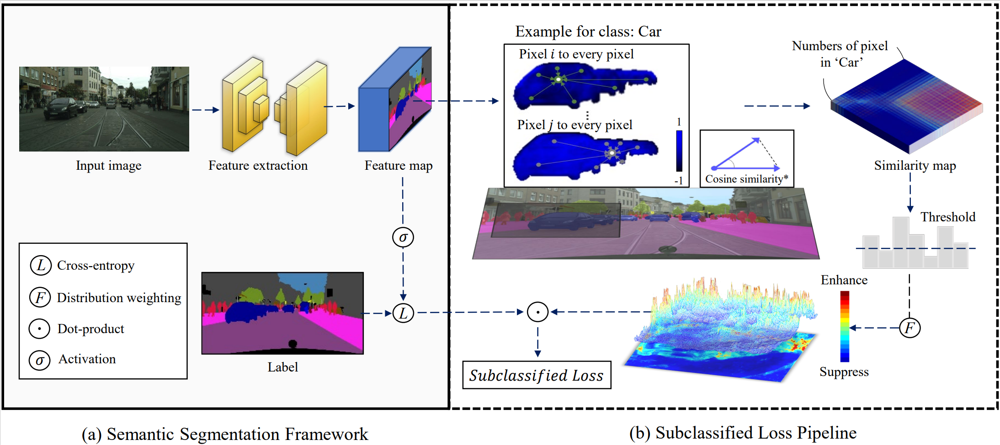

# Official code for our paper:  

<pre>
Subclassified Loss: Rethinking Data Imbalance from Subclass Perspective for Semantic Segmentation
Shoumeng Qiu$^\dagger$, Xianhui Cheng$^\dagger$, Hong Lu, Haiqiang Zhang, Ru Wan, Xiangyang Xue, Jian Pu$^\ast
$^\dagger$ Equal contribution
</pre>

        

#### 

Our code is very easy to use, simply replace the loss function mmseg/models/loss/cross_entropy_loss.py under the mmsegmenation framework with the code we provide. 

#### 

For the training details, please refer to the instructions provided in mmsegmentation codebase. 

####

We thanks for the opensource [mmsegmentation](https://github.com/open-mmlab/mmsegmentation) codebase。 
