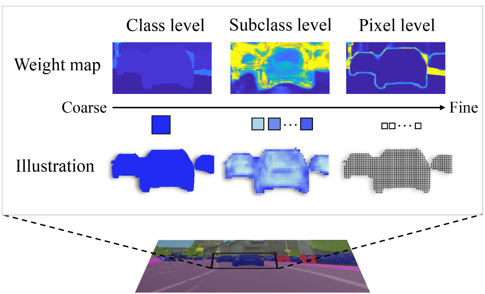

# Official code for our paper:  

<pre>
Subclassified Loss: Rethinking Data Imbalance from Subclass Perspective for Semantic Segmentation
Shoumeng Qiu*, Xianhui Cheng*, Hong Lu, Haiqiang Zhang, Ru Wan, Xiangyang Xue, Jian Pu
*Equal contribution
Corresponding-author: Jian Pu
</pre>

        

#### 

### Abstract

Semantic segmentation plays a crucial role in enabling intelligent vehicles to perceive and understand their surroundings. However, datasets used for semantic segmentation often suffer from data imbalance, where the number of pixels belonging to different classes varies significantly. To address this challenge, various novel loss functions have been proposed at the class or pixel level to counterbalance the data imbalance. In this study, we propose a novel approach to mitigate this problem from a subclass perspective. Specifically, we identify subclasses within each class based on the similarity of feature maps. These subclasses are then reweighted according to their distribution. Our approach can seamlessly transition into widely used loss functions, such as cross-entropy loss and class-weighted cross-entropy loss, in extreme cases. The proposed loss function is compatible with existing semantic segmentation methods, serving as a plug-in component for both current and future methodologies. We conducted extensive experiments on challenging datasets, namely SemanticKITTI and Cityscapes, to evaluate the effectiveness and generalization of our subclassified loss. Our experiments involved LiDAR-based and image-based methods, including RangeNet++, KPRNet, PointRend, STDC, and SegFormer, resulting in substantial improvements in terms of intersection-over-union (IoU) for segmentation. 

        

#### Code 

Our code is very easy to use, simply replace the loss function mmseg/models/loss/cross_entropy_loss.py under the mmsegmenation framework with the code we provide. 

For the training details, please refer to the instructions provided in mmsegmentation codebase. 

####

We thanks for the opensource [mmsegmentation](https://github.com/open-mmlab/mmsegmentation) codebase。 
