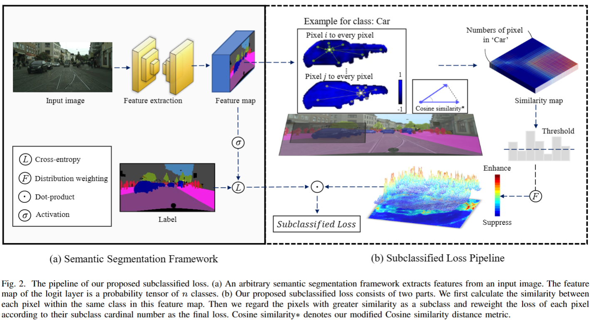

# 
Official code for our paper:  
Subclassified Loss: Rethinking Data Imbalance from Subclass Perspective for Semantic Segmentation

        
        <em>
        The pipeline of our proposed subclassified loss. (a) An arbitrary semantic segmentation framework extracts features from an input image. The feature map of the logit layer is a probability tensor of $n$ classes. (b) Our proposed subclassified loss consists of two parts. We first calculate the similarity between each pixel within the same class in this feature map. Then we regard the pixels with greater similarity as a subclass and reweight the loss of each pixel according to their subclass cardinal number as the final loss. Cosine similarity$*$ denotes our modified Cosine similarity distance metric.
        </em>

#### 

Our code is very easy to use, simply replace the loss function mmseg/models/loss/cross_entropy_loss.py under the mmsegmenation framework with the code we provide. 

#### 

For the training details, please refer to the instructions provided in mmsegmentation codebase. 

####

We thanks for the opensource [mmsegmentation](https://github.com/open-mmlab/mmsegmentation) codebase。 
